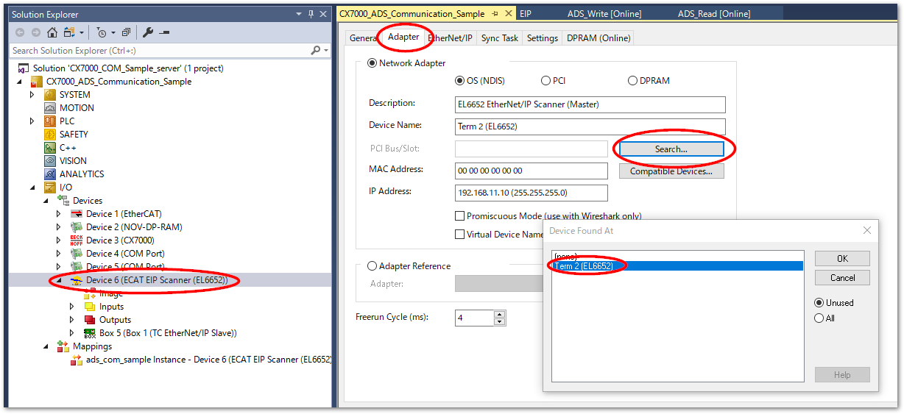
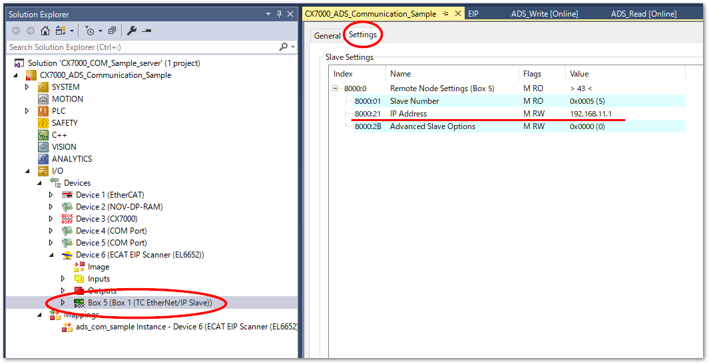
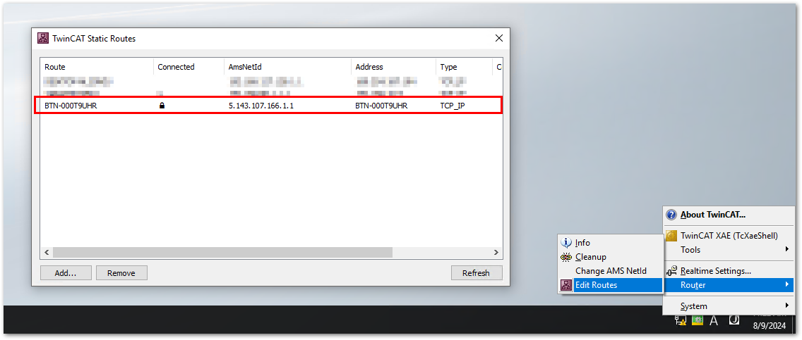

# CX7000を用いた通信サンプル

CX7000は安価なIPCですが、使用できるファンクションに限りがあります。このため外部とピアツーピアで通信できる手段が限られています。

この機器でも通信を可能とする以下の2とおりの方法についてご紹介します。

* ADS通信

    もっとも汎用的な通信手段です。.NET、JAVA、Pythonなど各種言語向けのAPIが用意されていますので、これを使えば

* EtherNet/IP

    EtherNet/IPのスキャナとして機能するEL6652を用いてEtherNet/IPアダプタ機器に接続し、データ交換する。

## ADS通信使い方

* CX7000_COM_Sample_server

    1. XAEで開き、CX7000をターゲットとしてリモート通信設定します。
    2. Device6のアダプタ設定をEL6652に設定します。

        

    3. Box 5 を選択し、Settingタブから接続しているアダプタのIPアドレスを設定します。

        

    4. クライアント側の操作に応じて次のプログラムの変数を確認してください。

        * ADS_Readプログラム

            nCounterにはIndex group 0x8E000001 ～ 3のADSコマンドに応じた個別の変数操作が行われる。

            stSample変数には、Index group 0x8E000004のADSコマンドにより構造体変数の要素の値操作が行われる。

        * ADS_Writeプログラム

            Index group 0x80000001 のADSコマンドを受けて、arrInt[0..9] のそれぞれの変数に0～9が格納される。

        * EIP プログラム

            eip_outputの全BYTE型変数に0～255の値が書き込まれ、eip_inputにCX7000でコピーされた値が返ってくる。また、diffに、eip_inputで返ってきた値のサイクル遅れ数が格納される。

* CX7000_COM_Sample_client

    1. XAEで開き、CX7000をターゲットとしてリモート通信設定します。サンプルでの開発環境ではC6015を使いましたが、それ以外のIPCをお使いの場合、`System` - `Real-time` から `Read from Target`ボタンを押してタスクとコア設定を最適化してください。
    2. ADS_ReadプログラムのfbReadReq.NETID, ADS_WriteプログラムのfbWriteReq.NETIDにそれぞれCX7000側のAMS NetIDを指定します。

    3. IPC内のルータ設定により、CX7000とのADSの接続設定を行ってください。

        

    4. Active configurationし、以下の通り動作を確かめてください。

        * ADS_Readプログラム

            * `bIncrement` をTRUEにすると、Index Group : 0x8E000001 を発行し、CX7000上のINT変数を1加算し、`nCounter`にその値を読み出します。
            * `bDecrement` をTRUEにすると、Index Group : 0x8E000002 を発行し、CX7000上のINT変数を1減算し、`nCounter`にその値を読み出します。
            * `bReset` をTRUEにすると、Index Group : 0x8E000003 を発行し、CX7000上のINT変数を0リセットして`nCounter`にその値を読み出します。
            * `bOther` をTRUEにすると、Index Group : 0x8E000005 を発行し、CX7000上ではサポートされていないIndex Groupのため、エラーコード[1794: ADSERR_DEVICE_INVALIDGRP](https://infosys.beckhoff.com/content/1033/tcplclib_tc2_system/374277003.html?id=8184646495904269857)を受け取ります。
            * `bReset` をTRUEにすると、Index Group : 0x8E000004 を発行し、CX7000上の構造体変数に以下の操作を行い、クライアント側でも同じ構造体を定義したインスタンス変数`stSample`にその値を読み出します。

                * title: `TEST` という文字列をセット
                * id: 1加算
                * datetime: CX7000側のFILETIMEをDT型へ変換した現在時刻をセット

        * ADS_Writeプログラム

            * 10個のサイズのarrInt配列に、0～9の値をセット
            * `bWrite` をTRUEにセットすると、arrIntの配列変数を、同じ型とサイズの配列変数を持つCX7000に展開する。

        * EIP_COMプログラム

            CX7000のスキャナから出力変数としてサイクリックに送られる64Byteのデータを同じサイズの入力変数にそのままミラーする。

## サンプルコード解説

以下のドキュメントをご覧ください。

[https://beckhoff-jp.github.io/TwinCATHowTo/ads_plc/index.html](https://beckhoff-jp.github.io/TwinCATHowTo/ads_plc/index.html)